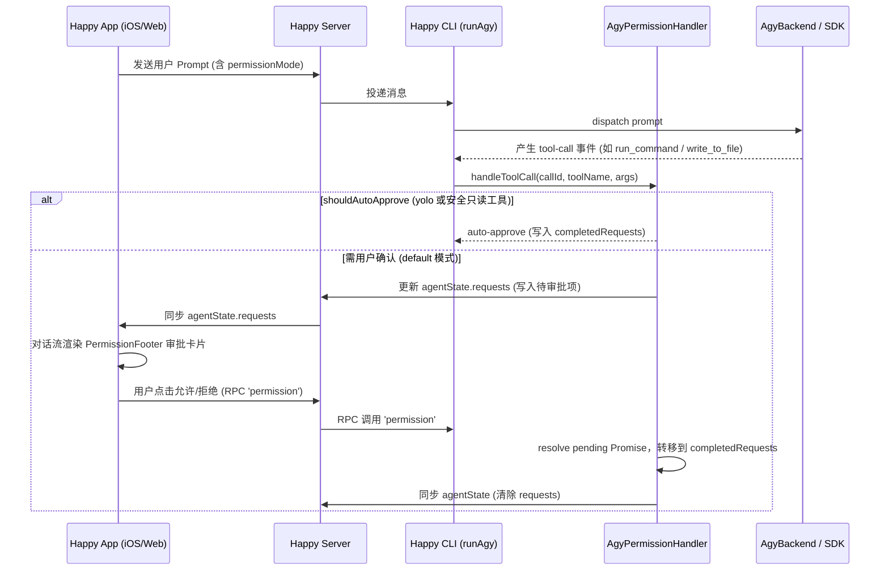

# Antigravity (Agy) Permission Handling

本文档说明 Happy CLI 中 Antigravity (`agy`) 代理的权限管理架构、数据流向及与移动端（Happy iOS/Android/Web）的权限确认交互机制。

## 1. 功能目标
在 Happy 客户端与 `agy` CLI 交互时，支持非 YOLO（`default` / `safe-yolo` / `read-only` / `acceptEdits`）模式下的工具与命令执行权限审批。
当底层代理准备执行需要确认的工具时，在客户端（如 Happy iOS）对话流中实时展示待审批工具卡片（`PermissionFooter`），支持用户点击“允许（Yes）”、“拒绝（No）”或“会话允许（Allow for session）”。

## 2. 核心入口
- `packages/happy-cli/src/agy/permissionHandler.ts` (`AgyPermissionHandler`)：负责权限判定、自动审批规则、待决请求管理与 RPC 响应处理。
- `packages/happy-cli/src/agy/runAgy.ts`：会话入口，初始化 `AgyPermissionHandler` 并挂载至 `session.rpcHandlerManager`，监听 `tool-call` / `tool-result` 事件并同步状态至 `agentState.requests`。
- `packages/happy-cli/src/agy/AgyBackend.ts` & `AgySdkBackend.ts`：底层执行引擎，透传 `permissionHandler` 与当前权限模式配置。

## 3. 架构关系与数据流



## 4. 关键数据结构
- `PermissionMode`：`'default' | 'acceptEdits' | 'bypassPermissions' | 'plan' | 'read-only' | 'safe-yolo' | 'yolo'`
- `PendingRequest`：
  ```ts
  interface PendingRequest {
    resolve: (value: PermissionResult) => void;
    reject: (error: Error) => void;
    toolName: string;
    input: unknown;
  }
  ```
- `agentState.requests`：
  ```json
  {
    "agy-step-1": {
      "tool": "run_command",
      "arguments": { "CommandLine": "ls -la" },
      "createdAt": 1771978800000
    }
  }
  ```

## 5. 权限模式策略矩阵
| 模式 (`permissionMode`) | 行为策略 |
| :--- | :--- |
| `yolo` / `bypassPermissions` | 全部工具自动放行（`approved_for_session`），带 `--dangerously-skip-permissions` |
| `safe-yolo` / `read-only` | 安全只读工具（`view_file`, `list_dir`, `grep_search` 等）自动放行，危险工具（`run_command`, `write` 等）需审批 |
| `acceptEdits` | 文件修改类工具自动放行，命令执行类工具（`bash`, `run_command`）需审批 |
| `default` | 除内省与元数据工具（`change_title`, `think`）外，所有工具均需用户确认 |

## 6. 异常路径与容错
- **用户中止（Abort）**：调用 `handler.abortAll()`，将未决审批标记为取消，并以 `{ decision: 'abort' }` 释放等待。
- **CLI 重启 / 会话重置**：调用 `handler.reset()`，清除历史残留的待审批状态，避免界面出现假死或孤立审批卡片。
- **掉线重连（Session Swap）**：通过 `updateSession(newSession)` 无缝重新绑定 RPC Handler 与 Session 句柄。

## 7. 测试验证方式
- `packages/happy-cli/src/agy/permissionHandler.test.ts`：覆盖所有权限模式的自动审批规则、RPC 审批流程、`abortAll()` 与 `reset()` 容错行为。
- `pnpm --filter happy typecheck`：验证 TypeScript 类型完整性。

## 8. 变更记录
- **2026-08-26**：初版创建。引入 `AgyPermissionHandler` 并打通 `runAgy.ts` 中的工具权限审批上报与客户端 RPC 闭环。
